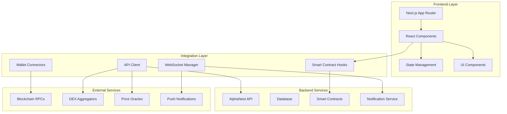

# Design Document - Frontend Completion

## Overview

This design document outlines the technical architecture and implementation strategy for completing the AlphaNest/PopCow frontend application. The project currently has a solid foundation with Next.js 14, TypeScript, and Tailwind CSS, but requires significant enhancements to transform from a prototype with mock data into a fully functional DeFi platform.

The design focuses on integrating real blockchain data, implementing smart contract interactions, and building robust user experiences across multiple chains (Solana, Ethereum, Base, BNB Chain).

## Architecture

### High-Level Architecture



### Technology Stack Enhancement

**Current Stack:**
- Next.js 14 with App Router
- TypeScript
- Tailwind CSS + shadcn/ui
- Wagmi + Viem (Ethereum)
- Solana Web3.js

**Required Additions:**
- TanStack Query for data fetching and caching
- Zustand for global state management
- Socket.io client for real-time updates
- TradingView Charting Library
- Web3Modal v3 for multi-wallet support
- Framer Motion for animations
- React Hook Form + Zod for form validation

## Components and Interfaces

### Core Data Models

```typescript
// User and Authentication
interface User {
  id: string;
  walletAddress: string;
  connectedWallets: ConnectedWallet[];
  preferences: UserPreferences;
  reputation: ReputationScore;
  points: number;
  level: number;
  createdAt: Date;
}

interface ConnectedWallet {
  address: string;
  chain: SupportedChain;
  type: WalletType;
  isVerified: boolean;
}

// Trading and Tokens
interface Token {
  address: string;
  symbol: string;
  name: string;
  decimals: number;
  chain: SupportedChain;
  logoUri?: string;
  price: number;
  priceChange24h: number;
  volume24h: number;
  marketCap: number;
  devInfo?: DevInfo;
}

interface DevInfo {
  address: string;
  reputation: ReputationScore;
  launchHistory: TokenLaunch[];
  rugCount: number;
  successRate: number;
  totalVolume: number;
  isVerified: boolean;
}

// Insurance and Risk Management
interface InsuranceProduct {
  id: string;
  tokenAddress: string;
  type: 'bullish' | 'bearish';
  premium: number;
  coverage: number;
  duration: number;
  poolSize: number;
  odds: number;
  isActive: boolean;
}

interface InsurancePolicy {
  id: string;
  productId: string;
  userAddress: string;
  amount: number;
  premium: number;
  startTime: Date;
  endTime: Date;
  status: PolicyStatus;
  claimAmount?: number;
}

// Cross-Chain ETF
interface ETFComponent {
  tokenAddress: string;
  chain: SupportedChain;
  weight: number;
  minHolding: number;
  isActive: boolean;
}

interface UserETFPosition {
  components: ETFComponentHolding[];
  totalValue: number;
  miningWeight: number;
  lastUpdate: Date;
}

// Copy Trading
interface Trader {
  address: string;
  nickname?: string;
  reputation: ReputationScore;
  totalPnL: number;
  winRate: number;
  followers: number;
  avgHoldTime: number;
  riskScore: number;
}

interface CopyTradeSettings {
  traderId: string;
  allocation: number;
  maxPerTrade: number;
  stopLoss?: number;
  takeProfit?: number;
  isActive: boolean;
}
```

### API Client Architecture

```typescript
// Centralized API client with type safety
class AlphaNestAPI {
  private client: AxiosInstance;
  private wsManager: WebSocketManager;
  
  // Authentication
  async authenticate(signature: string): Promise<AuthResponse>;
  
  // User Management
  async getUserProfile(address: string): Promise<User>;
  async updateUserPreferences(preferences: UserPreferences): Promise<void>;
  
  // Token Data
  async getTokens(filters: TokenFilters): Promise<Token[]>;
  async getTokenDetails(address: string, chain: SupportedChain): Promise<TokenDetails>;
  async getTokenChart(address: string, timeframe: string): Promise<ChartData>;
  
  // Dev Reputation
  async getDevProfile(address: string): Promise<DevInfo>;
  async getDevTokens(address: string): Promise<Token[]>;
  
  // Insurance
  async getInsuranceProducts(): Promise<InsuranceProduct[]>;
  async purchaseInsurance(productId: string, amount: number): Promise<TransactionHash>;
  async getUserPolicies(address: string): Promise<InsurancePolicy[]>;
  
  // Points and Rewards
  async getUserPoints(address: string): Promise<PointsBalance>;
  async claimDailyReward(): Promise<ClaimResult>;
  async verifyHoldings(proofs: HoldingProof[]): Promise<VerificationResult>;
  
  // Copy Trading
  async getTopTraders(): Promise<Trader[]>;
  async getCopyTradeSettings(address: string): Promise<CopyTradeSettings[]>;
  async updateCopyTradeSettings(settings: CopyTradeSettings): Promise<void>;
  
  // Real-time subscriptions
  subscribeToTokenUpdates(tokens: string[]): void;
  subscribeToUserNotifications(address: string): void;
  subscribeToTraderUpdates(traderIds: string[]): void;
}
```

### Smart Contract Integration

```typescript
// Smart contract hooks with proper error handling
export function useAlphaNestCore() {
  const { data: contract } = useContract({
    address: ALPHANEST_CORE_ADDRESS,
    abi: AlphaNestCoreABI,
  });
  
  const claimPoints = useMutation({
    mutationFn: async (proofs: HoldingProof[]) => {
      return contract?.write.claimPoints([proofs]);
    },
    onSuccess: (hash) => {
      toast.success('Points claimed successfully!');
      queryClient.invalidateQueries(['user-points']);
    },
  });
  
  const stakeTokens = useMutation({
    mutationFn: async ({ tokens, amounts }: StakeParams) => {
      return contract?.write.stakeTokens([tokens, amounts]);
    },
  });
  
  return { claimPoints, stakeTokens };
}

export function useAlphaGuard() {
  const purchaseInsurance = useMutation({
    mutationFn: async ({ productId, amount, premium }: InsuranceParams) => {
      const contract = getContract({
        address: ALPHAGUARD_ADDRESS,
        abi: AlphaGuardABI,
      });
      return contract.write.purchaseInsurance([productId, amount], {
        value: premium,
      });
    },
  });
  
  const claimInsurance = useMutation({
    mutationFn: async (policyId: string) => {
      const contract = getContract({
        address: ALPHAGUARD_ADDRESS,
        abi: AlphaGuardABI,
      });
      return contract.write.claimInsurance([policyId]);
    },
  });
  
  return { purchaseInsurance, claimInsurance };
}
```

## Data Models

### State Management Strategy

```typescript
// Global state with Zustand
interface AppState {
  // User state
  user: User | null;
  connectedWallets: ConnectedWallet[];
  
  // UI state
  theme: 'light' | 'dark';
  language: 'en' | 'zh';
  currency: 'USD' | 'CNY';
  
  // Trading state
  selectedTokens: Token[];
  tradingPairs: TradingPair[];
  
  // Notifications
  notifications: Notification[];
  unreadCount: number;
  
  // Actions
  setUser: (user: User | null) => void;
  addWallet: (wallet: ConnectedWallet) => void;
  updatePreferences: (preferences: Partial<UserPreferences>) => void;
  addNotification: (notification: Notification) => void;
  markAsRead: (notificationId: string) => void;
}

// Create store with persistence
export const useAppStore = create<AppState>()(
  persist(
    (set, get) => ({
      user: null,
      connectedWallets: [],
      theme: 'dark',
      language: 'en',
      currency: 'USD',
      selectedTokens: [],
      tradingPairs: [],
      notifications: [],
      unreadCount: 0,
      
      setUser: (user) => set({ user }),
      addWallet: (wallet) => set((state) => ({
        connectedWallets: [...state.connectedWallets, wallet]
      })),
      updatePreferences: (preferences) => set((state) => ({
        user: state.user ? { ...state.user, preferences: { ...state.user.preferences, ...preferences } } : null
      })),
      addNotification: (notification) => set((state) => ({
        notifications: [notification, ...state.notifications],
        unreadCount: state.unreadCount + 1
      })),
      markAsRead: (notificationId) => set((state) => ({
        notifications: state.notifications.map(n => 
          n.id === notificationId ? { ...n, isRead: true } : n
        ),
        unreadCount: Math.max(0, state.unreadCount - 1)
      })),
    }),
    {
      name: 'alphanest-storage',
      partialize: (state) => ({
        theme: state.theme,
        language: state.language,
        currency: state.currency,
        connectedWallets: state.connectedWallets,
      }),
    }
  )
);
```

### Real-time Data Management

```typescript
// WebSocket manager for real-time updates
class WebSocketManager {
  private ws: WebSocket | null = null;
  private subscriptions = new Map<string, Set<(data: any) => void>>();
  private reconnectAttempts = 0;
  private maxReconnectAttempts = 5;
  
  connect() {
    this.ws = new WebSocket(WS_ENDPOINT);
    
    this.ws.onopen = () => {
      console.log('WebSocket connected');
      this.reconnectAttempts = 0;
    };
    
    this.ws.onmessage = (event) => {
      const { type, data } = JSON.parse(event.data);
      const callbacks = this.subscriptions.get(type);
      if (callbacks) {
        callbacks.forEach(callback => callback(data));
      }
    };
    
    this.ws.onclose = () => {
      if (this.reconnectAttempts < this.maxReconnectAttempts) {
        setTimeout(() => {
          this.reconnectAttempts++;
          this.connect();
        }, 1000 * Math.pow(2, this.reconnectAttempts));
      }
    };
  }
  
  subscribe(type: string, callback: (data: any) => void) {
    if (!this.subscriptions.has(type)) {
      this.subscriptions.set(type, new Set());
    }
    this.subscriptions.get(type)!.add(callback);
    
    // Send subscription message
    if (this.ws?.readyState === WebSocket.OPEN) {
      this.ws.send(JSON.stringify({ action: 'subscribe', type }));
    }
  }
  
  unsubscribe(type: string, callback: (data: any) => void) {
    const callbacks = this.subscriptions.get(type);
    if (callbacks) {
      callbacks.delete(callback);
      if (callbacks.size === 0) {
        this.subscriptions.delete(type);
        if (this.ws?.readyState === WebSocket.OPEN) {
          this.ws.send(JSON.stringify({ action: 'unsubscribe', type }));
        }
      }
    }
  }
}

// React hook for real-time data
export function useRealTimeData<T>(
  type: string,
  initialData?: T
): [T | undefined, boolean] {
  const [data, setData] = useState<T | undefined>(initialData);
  const [isConnected, setIsConnected] = useState(false);
  
  useEffect(() => {
    const wsManager = WebSocketManager.getInstance();
    
    const handleData = (newData: T) => {
      setData(newData);
    };
    
    const handleConnection = (connected: boolean) => {
      setIsConnected(connected);
    };
    
    wsManager.subscribe(type, handleData);
    wsManager.subscribe('connection', handleConnection);
    
    return () => {
      wsManager.unsubscribe(type, handleData);
      wsManager.unsubscribe('connection', handleConnection);
    };
  }, [type]);
  
  return [data, isConnected];
}
```

Now I need to continue with the Correctness Properties section. Let me first use the prework tool to analyze the acceptance criteria.

<function_calls>
<invoke name="prework">
<parameter name="featureName">frontend-completion

## Correctness Properties

*A property is a characteristic or behavior that should hold true across all valid executions of a system—essentially, a formal statement about what the system should do. Properties serve as the bridge between human-readable specifications and machine-verifiable correctness guarantees.*

### Property 1: Real Data Integration
*For any* API endpoint that previously returned mock data, the system should now return real data from external services and never return hardcoded mock responses.
**Validates: Requirements 1.3, 1.4, 1.5, 2.3, 3.2**

### Property 2: Multi-Chain Wallet Connectivity
*For any* supported blockchain (Solana, Ethereum, Base, BNB Chain), users should be able to connect wallets and the system should correctly identify the chain and retrieve account information.
**Validates: Requirements 9.1, 9.2**

### Property 3: Real-Time Data Updates
*For any* data that changes frequently (prices, balances, notifications), the system should update within 2 seconds of the actual change occurring.
**Validates: Requirements 1.6, 11.3, 11.4, 11.5**

### Property 4: Trading Parameter Persistence
*For any* user-configured trading parameters (slippage, deadline, notification preferences), these settings should persist across browser sessions and be applied to all relevant operations.
**Validates: Requirements 2.4, 7.1, 7.2, 7.6**

### Property 5: Smart Contract Integration
*For any* smart contract interaction (insurance purchase, point claiming, staking), the system should correctly encode transaction data and handle both success and failure cases.
**Validates: Requirements 4.1, 4.2, 5.1, 5.2**

### Property 6: Cross-Chain Holdings Verification
*For any* user attempting to verify holdings across multiple chains, the system should use cryptographic proofs to validate ownership without requiring private key access.
**Validates: Requirements 6.2, 9.3**

### Property 7: Point Calculation Accuracy
*For any* point-earning activity (wallet connection, holdings verification, daily tasks), the system should calculate and award points according to the defined algorithms and prevent double-claiming.
**Validates: Requirements 5.2, 5.3, 5.4, 9.4**

### Property 8: Insurance Claim Processing
*For any* valid insurance claim (rug pull detection, policy conditions met), the system should automatically process the claim and transfer funds according to the policy terms.
**Validates: Requirements 4.5**

### Property 9: Copy Trade Execution
*For any* active copy trade configuration, when the followed trader executes a trade, the system should replicate the trade proportionally according to the follower's settings within the specified parameters.
**Validates: Requirements 8.2, 8.3, 8.7**

### Property 10: Responsive Design Consistency
*For any* screen size between 320px and 2560px width, all UI components should remain functional and properly formatted without horizontal scrolling or overlapping elements.
**Validates: Requirements 12.1**

### Property 11: Notification Delivery
*For any* configured notification trigger (price alerts, whale transactions, new token launches), the system should deliver notifications through all enabled channels (browser, Telegram) within 30 seconds.
**Validates: Requirements 11.1, 11.2, 11.3, 11.4, 11.5**

### Property 12: Performance Benchmarks
*For any* page load or API request, the system should meet the specified performance targets (page load < 2s, API response < 200ms) under normal load conditions.
**Validates: Requirements 15.1, 15.2**

### Property 13: Data Persistence and Synchronization
*For any* user setting or preference change, the data should be persisted locally and synchronized across devices when the user logs in from different locations.
**Validates: Requirements 7.6**

### Property 14: Security and Access Control
*For any* sensitive operation (trading, insurance claims, governance voting), the system should require proper authentication and authorization before allowing the action.
**Validates: Requirements 13.1, 13.3, 13.6**

### Property 15: ETF Component Management
*For any* ETF component addition or removal, the change should only be implemented after successful governance voting and should update all related calculations (mining weights, portfolio values) accordingly.
**Validates: Requirements 6.7, 14.1, 14.7**

## Error Handling

### Error Categories and Strategies

**Network and Connectivity Errors:**
- Implement exponential backoff for failed API requests
- Provide offline mode with cached data where possible
- Show clear connection status indicators
- Graceful degradation when external services are unavailable

**Blockchain Transaction Errors:**
- Parse and display user-friendly error messages
- Provide transaction retry mechanisms with adjusted gas fees
- Implement transaction status tracking and notifications
- Handle insufficient balance and approval scenarios

**User Input Validation:**
- Client-side validation with immediate feedback
- Server-side validation for security
- Clear error messages with suggested corrections
- Form state preservation during error correction

**Smart Contract Interaction Errors:**
- Handle contract revert reasons and display meaningful messages
- Implement transaction simulation before execution
- Provide gas estimation with safety margins
- Handle contract upgrade scenarios gracefully

### Error Boundary Implementation

```typescript
class ErrorBoundary extends Component<Props, State> {
  constructor(props: Props) {
    super(props);
    this.state = { hasError: false, error: null };
  }

  static getDerivedStateFromError(error: Error): State {
    return { hasError: true, error };
  }

  componentDidCatch(error: Error, errorInfo: ErrorInfo) {
    // Log error to monitoring service
    logger.error('React Error Boundary caught an error', {
      error: error.message,
      stack: error.stack,
      componentStack: errorInfo.componentStack,
    });
  }

  render() {
    if (this.state.hasError) {
      return (
        <ErrorFallback 
          error={this.state.error}
          resetError={() => this.setState({ hasError: false, error: null })}
        />
      );
    }

    return this.props.children;
  }
}
```

## Testing Strategy

### Dual Testing Approach

The testing strategy employs both unit tests and property-based tests to ensure comprehensive coverage:

**Unit Tests:**
- Test specific examples and edge cases
- Verify component rendering and user interactions
- Test API integration points and error scenarios
- Validate form submissions and data transformations
- Test wallet connection flows and transaction handling

**Property-Based Tests:**
- Verify universal properties across all inputs
- Test data consistency across different screen sizes
- Validate calculation accuracy with random inputs
- Test real-time update mechanisms with various data patterns
- Verify security properties across different user scenarios

### Property-Based Testing Configuration

**Testing Framework:** fast-check (JavaScript/TypeScript property-based testing library)
**Test Configuration:** Minimum 100 iterations per property test
**Test Tagging:** Each property test references its design document property using the format:
`// Feature: frontend-completion, Property {number}: {property_text}`

### Testing Implementation Strategy

**Component Testing:**
- Use React Testing Library for component behavior testing
- Test user interactions and accessibility compliance
- Verify responsive design across viewport sizes
- Test error states and loading conditions

**Integration Testing:**
- Test wallet connection flows end-to-end
- Verify API integration with real and mock backends
- Test smart contract interactions with local test networks
- Validate cross-chain functionality with testnet deployments

**Performance Testing:**
- Measure page load times and Core Web Vitals
- Test API response times under various load conditions
- Verify memory usage and potential memory leaks
- Test mobile performance on various device profiles

**Security Testing:**
- Validate input sanitization and XSS prevention
- Test authentication and authorization flows
- Verify secure handling of private keys and sensitive data
- Test against common web vulnerabilities (OWASP Top 10)

### Test Data Management

**Mock Data Strategy:**
- Maintain realistic mock data that mirrors production API responses
- Use factories for generating test data with proper relationships
- Implement mock WebSocket connections for real-time testing
- Create mock wallet providers for testing without real wallets

**Test Environment Setup:**
- Local blockchain networks (Hardhat, Solana Test Validator)
- Mock external APIs with configurable responses
- Test databases with seed data
- Isolated test environments for each test suite

This comprehensive testing approach ensures that both specific functionality and universal system properties are validated, providing confidence in the system's correctness and reliability.